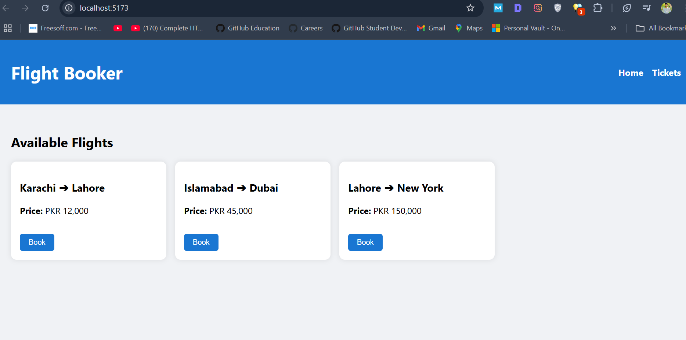
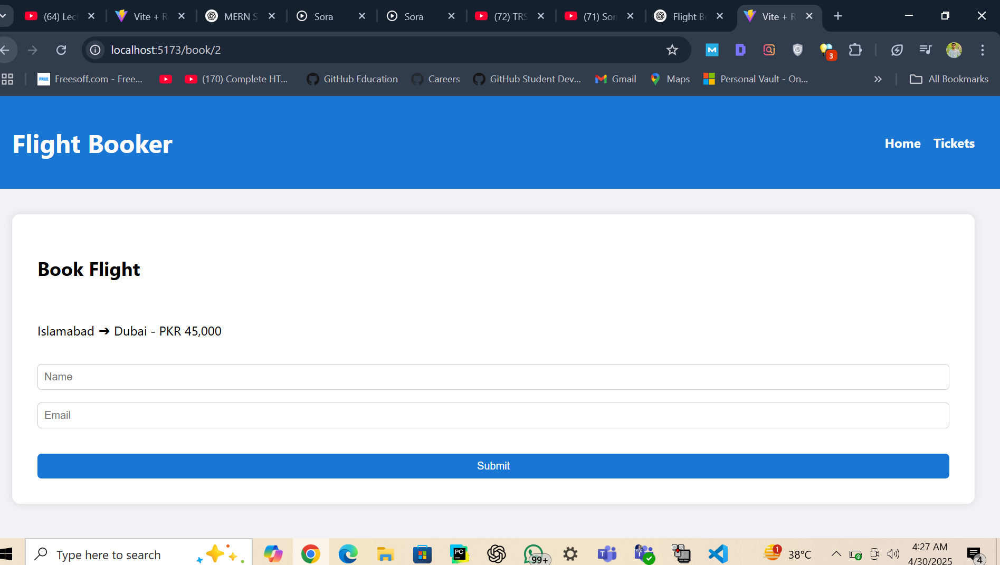

✈️ Flight Booking System (Frontend Only)
A responsive, single-page flight booking system built with React. Users can view available flights, book a flight by filling out a form, and see all booked tickets on a separate page—delivering an intuitive and elegant booking experience.

🌟 Features
✅ Built with React Functional Components and React Hooks (useState, useEffect)

✅ Dynamic flight list rendered using .map() on the home page

✅ "Book" button opens a form for the selected flight

✅ Booking form captures passenger details and confirms booking

✅ Tickets section displays all booked flights in a clean layout

✅ React Router for navigation between Home, Book, and Tickets

✅ Fully responsive UI with beautiful, modern CSS styling

✅ Smooth client interaction to ensure a top-tier experience

🖼️ Screenshots
🏠 Home Page (Available Flights)

📝 Booking Form

🎫 Tickets Page

💡 Make sure to add your actual screenshots in a src/screenshots/ folder.

📦 Tech Stack
Frontend: React (using Vite or CRA)

Routing: React Router

State Management: React Hooks (useState, useEffect)

Styling: CSS (custom-designed for a polished UI)

